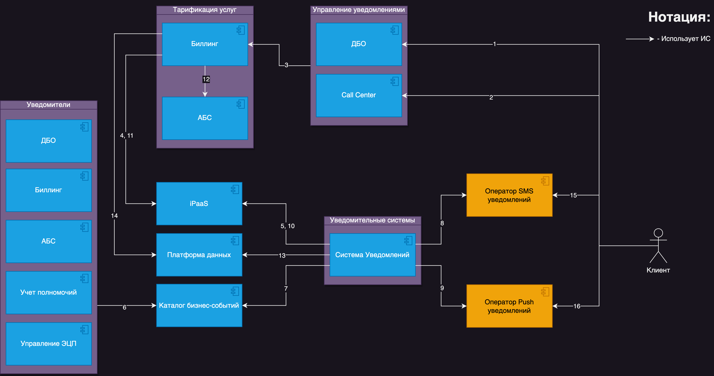
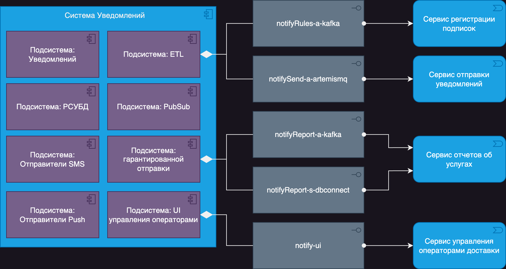

# Решение задачи #2

## Концептуальная архитектура решения

### Диаграмма КАР

### Таблица связей

| № | Описание |
| -- | -- |
| 1 | Клиент использует канал ДБО для самостоятельного управления услугой Уведомлений через веб или мобильное приложение. |
| 2 | Клиент использует контакт-центр для управления услугой Уведомлений через сотрудника банка. |
| 3 | Услуга активируется в учетной системе биллинга. |
| 4 | Биллинг использует iPaaS для передачи потока изменений услуг по клиентам другим системам. |
| 5 | Уведомительная система использует iPaaS для получения отфильтрованного потока изменений клиентов и их подключенных услуг. |
| 6 | Уведомители отправляют в Каталог бизнес-событий события разного типа: о неисполненных платежах (по различным причинам); об арестах на счетах (при наложении блокировки на счет и ее снятии); о движении средств по клиентскому счету; о входе в систему ДБО (Дистанционное Банковское Обслуживание); об активации ЭЦП (Электронной Цифровой Подписи) пользователя канала ДБО; о истечении полномочий должностного лица; |
| 7 | Система Уведомлений использует Каталог бизнес-событий для получения отфильтрованных бизнес-событий, которые могут быть использованы для SMS/Push уведомлений. |
| 8 | Система Уведомлений использует внешнего оператора SMS-уведомлений для отправки информационных SMS. |
| 9 | Система Уведомлений использует внешнего оператора Push-уведомлений для отправки информационных Push-уведомлений. |
| 10 | Система Уведомлений использует iPaaS для передачи потока событий уведомлений для учета в Биллинг-системе. |
| 11 | Биллинг-система использует iPaaS для получения потока фактически оказанных услуг уведомлений от Системы уведомлений для дальнейшей тарификации и учета. |
| 12 | Биллинг-система использует АБС для списания начислений за указанные услуги со счета клиента. |
| 13 | Система уведомлений использует Платформу данных для загрузки потока фактически оказанных услуг (п. 10) для формирования Витрины-отчета в платформе данных. |
| 14 | Биллинг-система использует Платформу данных для чтения Витрины-отчета о фактически оказанных услугах за учетный период для сверки. |
| 15 | Клиент использует внешнего оператора SMS для получения SMS-уведомлений. |
| 16 | Клиент использует внешнего оператора Push для получения Push-уведомлений. |

# Архитектура систем

### [Общие правила](../Rules.md)

### Диаграмма АС (ИС "Система Уведомлений")

### Описание подсистем системы Уведомлений:

| Подсистема | Описание |
| -- | -- |
| ETL | Подсистема, которая согласно [общим правилам](../Rules.md), может быть готовым целевым продуктом или просто ролью самописанного микросервиса. Принимает поток изменений, подписанных на услуги для пользователей из Биллинг-системы. |
| PubSub | Подсистема, которая согласно [общим правилам](../Rules.md), реализует паттерн Pub/Sub для распределения заданий рассылки между подсистемами-отправителями SMS/Push для балансировки нагрузки. Внутренняя очередь гарантированной доставки конкретным воркерам. |
| РСУБД | Подсистема, которая согласно [общим правилам](../Rules.md), одобрена для OLTP-нагрузки в банке в редационных БД. В данном случае используется для ведения журнала полученных через ETL сообщений для рассылки и реализации гарантированной доставки. В этой БД ведется журнал доставок подсистемой-оркестратором "Подсистема Уведомлений", также, в этой БД ведется журнал фактически отправленных или не отправленных уведомлений для дальнейшего учета в биллинге. Эта БД также используется для повторных попыток отправки через систему Pub/Sub конкретных сообщений SMS/Push в воркеры рассылки, чтобы обеспечить гарантированную доставку с повторными попытками. В этой БД при помощи ETL собираются сведения по пользователям, у которых есть активная подписка на те или иные услуги для дальнейшей фильтрации событий из Каталога бизнес-событий. |
| Отправители SMS | Воркер-процессы конкретного типа сообщений (в данном случае SMS) или конкретного оператора доставки сообщений. Обеспечивают балансировку и параллельное выполнение множественных задач отправки сообщений. Реализуют паттерны Circuit Breaker, DLQ, Adapter. Выбирают оператора отправки SMS исходя из критичности сообщения, стоимости доставки, готовности оператора принимать сообщения, статуса доставки. |
| Отправители Push | Воркер-процессы конкретного типа сообщений (в данном случае Push) или конкретного оператора доставки сообщений. Обеспечивают балансировку и параллельное выполнение множественных задач отправки сообщений. Реализуют паттерны Circuit Breaker, DLQ, Adapter. Выбирают оператор доставки Push-сообщений исходя из ключа сообщения, определяя по нему вендора устройства. |
| Подсистема Уведомлений | Основной оркестратор процесса, обеспечивает консистентную доставку, ведение журнала оказанных услуг, фильтрацию бизнес-сообщений согласно подпискам, контролирует количество попыток отправки, выбирает метод отправки уведомлений. |
| Подсистема гарантированной отправки | Подсистема, которая согласно [общим правилам](../Rules.md), реализует паттерн Transaction Outbox. Гарантированно доставляет отчеты об оказанных услугах рассылки в учетные системы через iPaaS и Платформу данных. |
| UI управления операторами | Пользовательский интерфейс управления операторами рассылки (добавление, удаление, изменение, активация, деактивация) и правилами рассылки для них (например, отправка SMS с OTP более дорогим оператором доставки SMS с большей вероятностью доставки). |

## Диаграмма потоков данных

Это не самый удачный вид диаграммы, если речь идет о классических DFD, потому что сложно найти поддержку нотаций этого вида диаграмм в открытых инструментах. В данном случае слишком много связей, особенно если разбивать каждую систему на Process, External Entity и Data Store. Обычно ее заменяют на BPMN, Sequence diagram или диаграмму взаимодействия систем в ArchiMate, в зависимости от необходимости отображения бизнес-процессов, последовательности или систем с подсистемами, интерфейсами и протоколами.

Я несколько раз пытался нарисовать ее вручную или через подход Diagram as a Code в надежде, что инструмент сможет расположить элементы и связи лучше, но диаграмма получилась нечитаемой. Проще читать ее код глазами прямо в [исходном файле](src/dfd.d2). Прикладывать изображение не имеет смысла, так как оно абсолютно нечитаемо.

## Architecture Decision Log

[Текст задания](../README.md)

- При проектировании забыли упомянуть систему регистрации Device Token для мобильных устройств, которая необходима для рассылки сообщений. Предполагается, что она уже существует в Мобильном банке и может отправлять Device Token в Систему Уведомлений также через iPaaS.
- Также при проектировании предполагается, что в Банке уже имеются системы iPaaS, Платформа данных и Каталог бизнес-событий.
- Почему не используется отдельная очередь сообщений от систем-отправителей в систему Уведомлений? Подразумевается, что все системы в Банке отправляют бизнес-события, которые необходимы не только для SMS/Push-уведомлений, но и для других бизнес-процессов. Для этого используется Каталог бизнес-событий.
- Почему сразу не использовать воркеры рассылки для очереди уведомлений? Фактически сейчас используются две очереди: бизнес-событий и событий уведомлений. Первая очередь представляет собой бизнес-события разных систем, которые содержат необходимые признаки для фильтрации. Вторая очередь чисто техническая и находится внутри самой ИС уведомлений. Эта очередь отвечает за рассылку через множество воркеров.
- Почему бы системам-источникам событий самим не отправлять уведомления и не использовать единую точку отказа? Несмотря на паттерн ограниченных контекстов и подход, что уведомления - это сущность того же домена, спроектированная мной система не просто воркеры уведомлений, она чуть более сложная и больше похожа на SOA, чем на MSA подход. Такой стиль используется в более зрелых Large Enterprise, чтобы избежать множественных интеграций с биллингом, иметь одну точку аудита ИБ, единые правила, стек и команду, ответственную за развитие этой ИС. Обычно она не является единой точкой отказа из-за хорошей кластеризации и может пережить дробление для разных Глобальных бизнес-линий банка (ГБЛ).
- Как обеспечивается гарантия доставки сообщений? Это происходит в несколько этапов, начиная с того, что каждая система, которая что-то отправляет в Каталог бизнес-событий или iPaaS, реализует паттерн Transaction Outbox и ведет у себя журнал. Система iPaaS реализует классический Message Queue, который обменивается с брокером и его клиентами статусами обработки сообщений. Также используется DLQ для сообщений, которые нельзя доставить. И, наконец, используется Circuit Breaker для контроля доставки на граничных точках с операторами конкретного типа сообщений.
- Почему система уведомлений отправляет отчеты оказанных рассылках двумя путями: через iPaaS и Платформу данных? Обычно это стандарт для такого типа компаний. Оба варианта доставки со стороны отправляющей системы представляют собой один и тот же поток изменений объектной модели данных через один и тот же транспорт. Канал через iPaaS представляет собой более оперативный вариант получения отчета в режиме near real-time (NRT), тогда как канал доставки отчетов через витрины данных в Платформе данных больше подходит для получения агрегированной отчетности за период в аналитических, учетных или целях сверки.
- Биллинг общается с другими системами, используя поток изменений своей логической модели услуг пользователей для большей оперативности. Так как такие системы, как Система Уведомлений, оперативно узнают, на какие сообщения стоит подписаться в Каталоге бизнес-событий, чтобы начать их рассылать. Это является единым стандартом для таких типов компаний, чтобы оперативно общаться с другими системами. Более медленный вариант может быть реализован через Платформу данных в виде периодических выгрузок.
- В данном проекте раскрыты не все взаимодействия между системами, а только те, которые напрямую связаны с задачей. Например, за скобками остается общение группы систем "Управление уведомлениями" и "Тарификация услуг". Предполагается, что эти системы спроектированы согласно [общим правилам](../Rules.md) и используют несколько каналов связи, включая синхронный REST для гарантированного обновления состояния услуг в режиме реального времени, и асинхронный для более сложных отложенных бизнес-процессов.
- Данное решение на самом деле не основано на стеке компании текущего работодателя из-за NDA. Реальные системы сильно детерминированы и слишком сложны для отображения на данных схемах. Каждая система имеет свой собственный паспорт и свои интеграции. Они могут быть спроектированы не идеально, так как находятся в процессе трансформации.