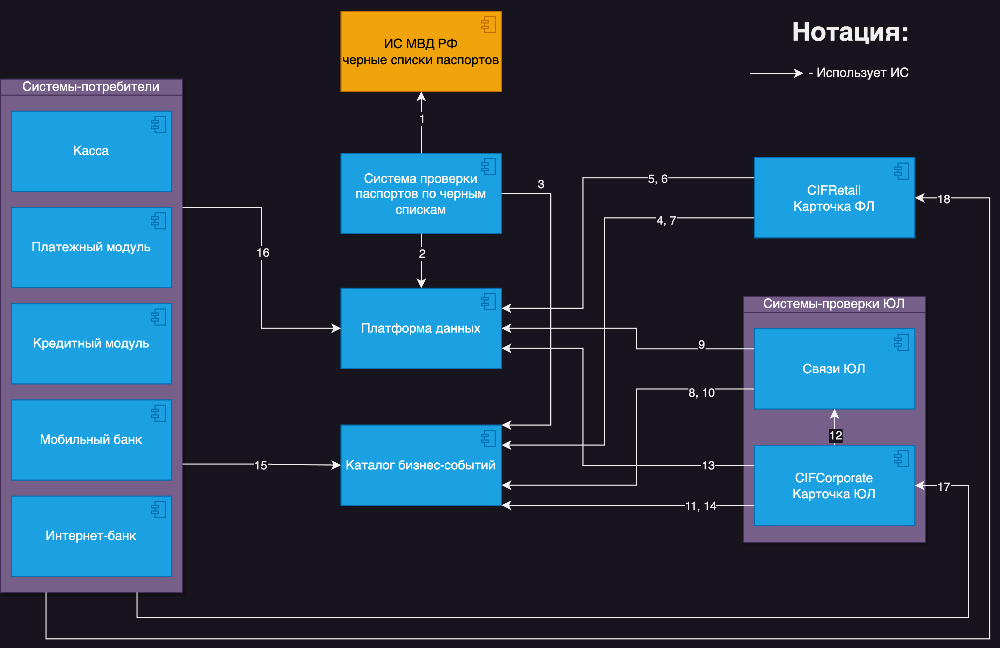
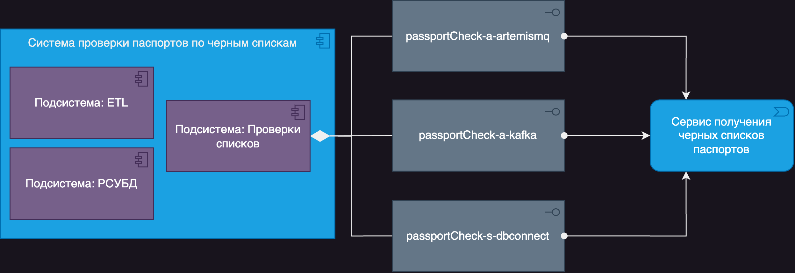
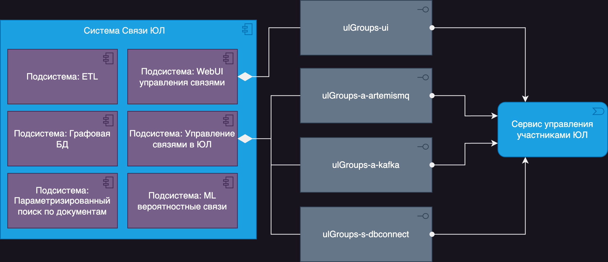
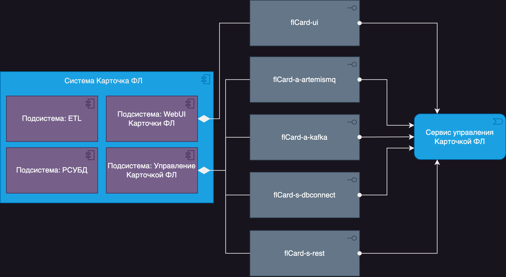
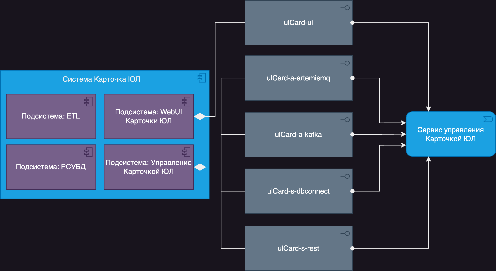

Текст содержит несколько опечаток и ошибок. Вот исправленная версия:

# Решение задачи #3

## Концептуальная архитектура решения

### Диаграмма КАР

### Перечень информационных потоков

| № | Описание |
| -- | -- |
| 1 | Использование сторонней ИС МВД для получения выгрузки черного списка паспортов по расписанию. |
| 2 | Выгрузка черных списков паспортов после обработки и дедубликации в Платформу данных в слой хранения в соответствии с Единой моделью данных. |
| 3 | Публикация события обновления черных списков паспортов в соответствии с зарегистрированной схемой бизнес-событий. |
| 4 | Получение события обновления черных списков системой учета Физических лиц в соответствии с подпиской на бизнес-события. |
| 5 | Получение обработанных черных списков паспортов из Платформы данных через Витрины данных. |
| 6 | Выгрузка изменений в карточках физических лиц в Платформу данных в соответствии с объектной моделью изменений Единой модели данных после сопоставления имеющейся базы ФЛ с черным списком паспортов. |
| 7 | Публикация события обновления карточек физических лиц банка в соответствии с зарегистрированной схемой бизнес-событий. |
| 8 | Получение события обновления черных списков системой учета связей Юридических лиц в соответствии с подпиской на бизнес-события. |
| 9 | Получение обработанных черных списков паспартов из Платформы данных через Витрины данных. |
| 10 | Публикация события обновления в связях Юридических лиц в дереве участников ЮЛ после проверки по черным спискам паспортов. |
| 11 | Получение события обновления структуры связей Юридических лиц в соответствии с подпиской на бизнес-события. |
| 12 | Получение плоской структуры изменений в профилях Юридических лиц, которые следует обновить в учетной системе Юридических лиц. |
| 13 | Выгрузка изменений в карточках юридических лиц в Платформу данных в соответствии с объектной моделью изменений Единой модели данных после сопоставления имеющейся базы ЮЛ с черным списком паспортов через систему связей ЮЛ. |
| 14 | Публикация события обновления карточек юридических лиц банка в соответствии с зарегистрированной схемой бизнес-событий. |
| 15 | Получение системами-потребителями событий: обновление черных списков паспортов; обновление карточек ЮЛ; обновление карточек ФЛ; в соответствии с подпиской на бизнес-события. |
| 16 | Получение данных из Витрин данных: черные списки паспортов; карточки ЮЛ; карточки ФЛ. |
| 17 | Проверка списка ЮЛ по каталогу банка, в том числе на пометки KYC. |
| 18 | Проверка списка ФЛ по каталогу банка, в том числе на пометки KYC. |

Вот исправленный текст с опечатками и ошибками:

## Архитектура систем

### [Общие правила](../Rules.md)

### Диаграмма АС (ИС "Система проверки паспортов по черным спискам")

### Диаграмма АС (ИС "Связи ЮЛ")

### Диаграмма АС (ИС "Карточка ФЛ")

### Диаграмма АС (ИС "Карточка ЮЛ")

## Диаграмма потоков данных

Это не самый удачный вид диаграммы, если речь идет о классических DFD, потому что сложно найти поддержку нотаций этого вида диаграмм в открытых инструментах. В данном случае слишком много связей, особенно если разбивать каждую систему на Process, External Entity и Data Store. Обычно ее заменяют на BPMN, Sequence diagram или диаграмму взаимодействия систем в ArchiMate, в зависимости от необходимости отображения бизнес-процессов, последовательности или систем с подсистемами, интерфейсами и протоколами.

Я несколько раз пытался нарисовать ее вручную или через подход Diagram as a Code в надежде, что инструмент сможет расположить элементы и связи лучше, но диаграмма получилась нечитаемой. Проще читать ее код глазами прямо в [исходном файле](src/dfd.d2). Прикладывать изображение не имеет смысла, так как оно абсолютно нечитаемо.

## Architecture Decision Log

Разбор по порядку написания [текста задания](../README.md)

- Для начала нужно получить от МВД список в архиве bzip2 через HTTPS. Для этого есть несколько вариантов, начиная от создания задания через дизайн-студию какого-то ESB или DI, который может разложить данные на сообщения или сразу записать в БД. Но будем считать, что паттерн ESB отходит, и мы его не используем. Далее также есть ветвление решений, и я бы выбирал между хорошим ETL уровня Enterprise, таким как Informatica PowerCenter, бесплатным Apache NiFi и чем-то самописанным, если таких задач мало. Если нет возможности использовать ETL, то самописанный вариант я бы рассматривал на основе Apache Spark, потому что это отличный оркестратор распределенных заданий трансформации данных для Java, Scala, Python и R, который может следить за каждым потоком заданий отдельно, нарезать потоки на задния, оптимизируя производительность, разделять потоки чтения и записи, а в промежутке использовать RDD-файлы как журнал со смещением для повторов после прерывания заданий (для этого потребуется S3-совместимое хранилище). Этому решению не хватает только планировщика заданий, вроде Spring Task Scheduler, что позволит собрать всю конструкцию внутри приложения Spring Boot, если использовать Spark как библиотеку.
- Также, любое из перечисленных выше решений, используя реляционную базу данных рядом с таким импортером, сможет решить проблемы дедубликации данных и проверки их качества в импортируемом файле (например, пустые записи), чтобы в БД остались только данные более высокого качества.
- После задачи импорта можно приступить к следующим задачам: оповестить другие системы, что импорт завершен, и данные обновились, заставить системы учета ФЛ и ЮЛ изменить KYC-статус для уже существующих клиентов и предоставить возможность проверки по новым спискам создаваемых клиентов, данные о которых еще не содержатся в учетных системах. Для решения этой задачи есть несколько путей, но нужно разделить их на кейсы:
  - Проверяемый потенциальный клиент ранее не пользовался нашими услугами и отсутствует в учетных системах. В зависимости от бизнес-процесса, проверка может быть синхронной и асинхронной. Если бизнес-процесс подразумевает паузу для проверки документов (например, совмещение с проверкой ИБ или рисков RORAC), то можно использовать асинхронный транспорт и ждать ответа, делать повторные попытки, если есть проблемы с транспортом, и реализовывать Transaction Outbox для надежности. Если есть процесс, который требует более быстрого и моментального ответа, чтобы определить, работаем ли мы с этим клиентом из-за потенциальных проблем с документами, то предпочтительнее использовать синхронный транспорт. Однако он может вызвать проблемы для batch-заданий обработки данных. Для решения этой задачи можно использовать несколько интерфейсов в каждой ИС, чтобы они реализовывали операции над одной и той же моделью данных и объектами данных. Конкретно, предлагается системе, в зависимости от бизнес-процесса и технических возможностей, выбрать между заказом для себя быстрой кешируемой витрины данных для SQL-поиска (по сути, полная автоматизированная инсталляция части компонентов платформы данных внутри нее же под ваши ФТ и НФТ). Если это не приемлемо, то можно также применить оптимизацию, кешируя эти данные из платформы данных у себя. Это позволит получить данные более оперативно, сами данные являются триггером к действию их импорта (EDA), что обеспечивает максимальную свежесть данных. Также можно использовать сообщения из Каталога бизнес-событий об изменении данных в источнике, чтобы начать импорт из платформы данных к себе - этот вариант лучше, потому что вы не зависите от изменений расписания импорта или попыток нового импорта в источнике. Также можно использовать тот же самый канал данных, который использует система-источник списков для отправки в платформу данных для своих нужд и наполнение своего кеша. В данном примере это Kafka-транспорт с единым форматом данных в виде потока изменений объектной модели. Этот вариант позволит получить данные более оперативно, сами данные являются триггером к действию их импорта (EDA), вы получаете максимальную свежесть данных, но тогда вам придется выполнить часть работы платформы данных, включая склеивание из потока изменений объектной модели у себя, дрейф запросы инициирующих данных в самом начале, обработку других топиков статусов, которые превращают этот канал в RPC, и обработку топиков с DLQ. Для быстрого кеширования в своей копии БД можно использовать [встроенные механизмы Tarantool](https://www.tarantool.io/en/patterns/), напоминающие работу CDC, которые копируют себе все изменения и как бы становятся частью кластера БД (только как бы). Промышленное использование в крупных компаниях в РФ - один крупный банк из ТОП3 (не могу разглашать) и [Аэрофлот](https://habr.com/ru/companies/vk/articles/497404/).
  - Проверка по базе существующих клиентов компании в учетных системах: здесь также есть несколько ветвлений, и архитектура может постепенно эволюционировать, улучшая свои интеграции. Можно через REST-запросы в учетных системах Карточка ФЛ и Карточка ЮЛ проверить клиента. Данные в этих ИС уже предрассчитаны на момент запроса, не рассчитываются на лету, и этот запрос будет обработан достаточно быстро, так как он представляет собой поиск по индексированной БД подготовленных данных в этих сервисах. Сами REST-интерфейсы уже рассчитаны на batch-обработку и ожидают на вход массив из 1+ проверяемых данных клиентов. Этот вариант подходит для быстрого ответа в синхронных процессах, где нет возможности создавать у себя кеш или заказывать дата-продукт в Платформе данных. Вариант с кешированием данных у себя или использование витрины дата-продукта в Платформе данных аналогичен описанному выше для новых клиентов, которых нет в учетных ИС. Все ИС выгружают свои объектные модели в Платформу данных, поэтому процесс не отличается. Оптимизации с кешированием и триггерами обновления кеша точно такие же.
- Почему работу с черными списками стоит вести в учетных системах профилей ЮЛ и ФЛ? - Сравнив количество данных из выгрузки паспортов и количество данных клиентов, проще передавать списки в учетные системы клиентов, чем делать это иначе. Это также более логичный шаг с точки зрения понимания систем владельцев данных и работы с MDM.
- Почему в этой архитектуре Платформа данных сама не получает данные из МВД и не хранит их? - Обычно такие системы имеют ETL и могли бы сами выполнить эту задачу, но тогда теряется anti-corruption layer, и Платформа данных начинает выполнять функции, которые ей не следует выполнять, что увеличивает нагрузку на команды, обслуживающие эту группу систем. Интеграция с МВД, а также источниками черных списков, всегда может меняться и потребовать более сложных процессов обработки внутри себя. Тем не менее, это не входит в зону ответственности платформы хранения и контроля качества данных компании. Обычно ETL в таких системах нужен только для того, чтобы помочь системам без технических или финансовых возможностей передать свои данные в эту самую Платформу данных, например, CDC из чужой системы, подобной коробочной АБС.
- Почему все системы выгружают свои данные в главное хранилище, а не используют только собственные? - Собственные хранилища также используются, потому что схемы данных в собственных хранилищах могут меняться намного чаще, чем логические модели в Платформе данных. Также локальные хранилища ИС могут использовать другие технологии, например, из экспериментального стека компании. В них также могут храниться уникальные для ИС сущности, не входящие в модель данных этой ИС, такие как кеши других ИС, архивы, логи (плохой пример, но бывает), и так далее. Платформа данных обычно не является бесконечным хранилищем всех данных ИС, а только сущностей, соответствующих модели данных и практикам управления данными компании. С точки зрения финансовых затрат этот подход примерно сопоставим с расходами на хранение такого же объема данных непосредственно в самих ИС, только лишен проблем, связанных с агрегацией нескольких моделей данных разных соседних ИС. Таким образом, в таких системах обычно контролируется качество данных, и может происходить агрегация данных с разных ИС в рамках единой модели данных компании. С точки зрения финансовых затрат этот подход примерно сопоставим с расходами на хранение такого же объема данных прямо в ИС, только лишен проблем, когда ИС нужно агрегировать несколько моделей данных разных соседних ИС, и в этом случае придется создавать копии данных и агрегировать их.
- Почему Каталог бизнес-событий и чем он отличается от обычного MQ? - Обычно такие системы более зрелые, чем просто MQ, Straming или Pub/Sub-системы. Часто они отличаются набором различных протоколов интеграции, от HTTP до каких-то проприетарных. Основным плюсом является их контрактная модель работы. В таких системах вы не просто отправляете что-то в систему, показав максимум свой JSON для интеграции, а регистрируете свои сообщения в удобном каталоге с дополнительной метаинформацией о системе или даже разрабатывающей команде. Это что-то вроде DevPortal, в котором можно заказать в том числе составные сообщения из ряда ИС с учетом условий. Это переход от EDA-архитектуры к EBA. Примерами могут служить https://www.eventcatalog.dev и [Amazon EventBridge](https://docs.aws.amazon.com/eventbridge/latest/userguide/eb-event-bus.html).
- Почему ArtemisMQ? - После постепенного отхода IBM MQ из банковского сектора новым стандартом в этой области становится Apache ActiveMQ 5, который также известен как Apache ActiveMQ Artemis, или ArtemisMQ. Эта система не является просто продолжением старого Apache ActiveMQ 4 (который также называется Apache ActiveMQ Classic), который перестал справляться с потребностями современного мира. Эту систему полностью переработали, и она стала новым банковским стандартом даже для индустрии NeoBanking, где примером может служить [Corda](https://corda.net/) на основе Blockchain для главной книги многих банков. И не стоит забывать, что системы класса MQ, Straming или Pub/Sub-системы плохо сочетаются с функциями своих соседей.
- Почему система работы с ЮЛ разделена на две разные ИС? - Это вполне логичный шаг с точки зрения работы с деревом участников ФЛ, как указано в условии задачи. Такие ИС обычно предоставляют несколько вариантов создания связей. Первый вариант - это официальные открытые источники (которые остаются за пределами данного решения) и обычно содержат открытые данные от государственных систем и регуляторов. Второй вариант - это вероятностные связи, которые основываются на данных, собранных из разных источников внутри и вне компании и используют ML-алгоритмы для определения связей. Третий вариант - это ручные связи, создаваемые через пользовательский интерфейс этой ИС по разным причинам. Если ответственный эксперт из своих источников решит создать такую связь для уменьшения рисков компании (например, для пометки теневого учредительства), то он может это сделать. В то же время связи и ведение профилей ЮЛ - это разные контексты, поэтому для их учета в учетной системе существует отдельная ИС.
- Избыточно ли использование множества интерфейсов в одной ИС? - На самом деле нет, если это стало стандартной практикой в компании. Если в компании есть зрелая практика Data Governance и понимание разницы между физической моделью хранения данных и логической моделью данных, а также согласованная единая модель данных для всей компании, то все интерфейсы могут строиться как операции над сущностями логической модели данных. Если компания может себе позволить перейти на транспорт gRPC, то задача становится еще более простой, поскольку gRPC может использоваться для синхронного запрос-ответ и других сценариев использования, включая асинхронное взаимодействие и стриминг данных в ту же платформу данных. Если в компании используется подход DDD (Domain-Driven Design), то доменные события могут легко превращаться в бизнес-события для Каталога бизнес-событий. Но даже без этого подхода формирование этих событий не должно вызывать проблем, если есть понимание логической модели данных ИС и нотификации из ее объектов.
- Почему в нотификациях не отправляются сразу сами данные? Из-за раскрытия информации, чтобы можно было создавать только подписку на легкие уведомления, агрегировать и управлять ими в системах, которым не требуются сами данные (например, для дальнейших push-уведомлений).
- Почему используется Apache Kafka для передачи данных? Эта система относится к классу Streaming и отличается сценариями использования от MQ или Pub/Sub систем, что делает ее отличным выбором для передачи больших объемов данных между системами в стиле потока изменений, подобно CDC. В отличие от аналогичных продуктов, таких как RedPanda или Pulsar, Kafka является более популярным решением и обладает встроенным Java Application Server, который позволяет встраивать логику внутри стриминг-системы, такую как обогащение данных, агрегация, работа с kSQL или создание Kafka Connector. Более того, эта система в теории CAP скорее выступает как консистентная система с высокой степенью гарантии консистентности данных.
- Почему система создания связей в ФЛ использует графовую БД, и какую именно? - Поскольку участие физических лиц в юридических лицах может быть сложно связанным в стиле М2М (many-to-many), то проще использовать графовую базу данных, по которой легко выполнять графовые операции, такие как поиск по вершинам. Это представление также отлично подходит для отображения таких связей и для работы с ML-алгоритмами, которые определяют вероятностные связи. Я бы рекомендовал использовать для этой роли ArangoDB, которая имеет преимущество перед Dgraph, Neo4j и AWS Neptune, поскольку она не является коммерческим продуктом или SaaS-решением.
- Почему системы "Связи ФЛ" и "Карточка ФЛ" связаны через Kafka, а не так, как другие ИС связаны между собой? - Эти системы имеют прочные внутренние связи в рамках бизнес-процесса, и они также связаны напрямую, чтобы продемонстрировать различные методы интеграции. Предполагается, что сами эти системы не имеют установленный Kafka только для этой задачи, а используют общий iPaaS (интеграционную платформу как сервис) для обмена сообщениями.
- Системы "Связи ЮЛ", "Карточка ФЛ" и "Карточка ЮЛ" также имеют свой пользовательский интерфейс для ручного создания и редактирования учетных объектов.
